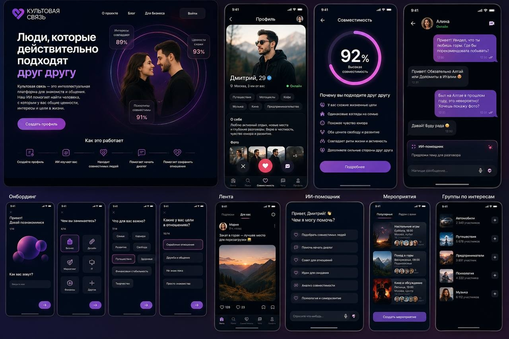
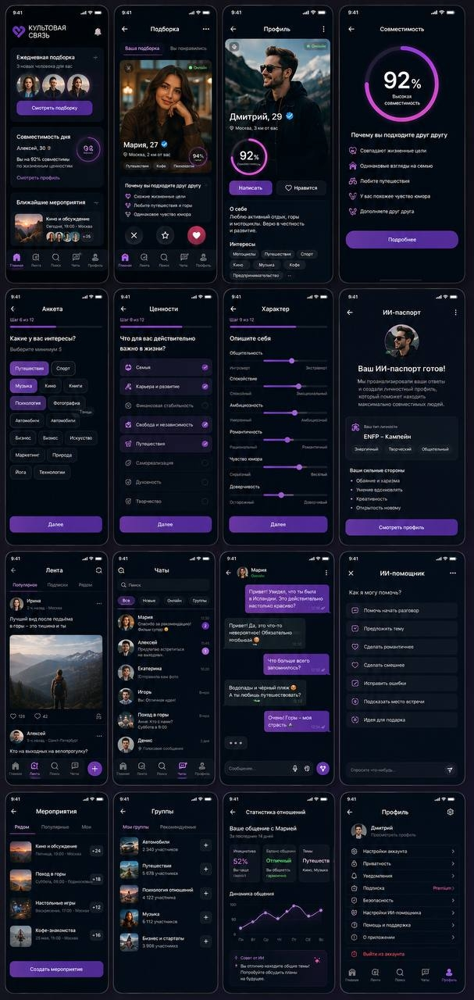

# 🌟 КУЛЬТ - ЭТО БОЛЬШЕ, ЧЕМ БАРБЕРШОП

> **Интеллектуальная социальная сеть нового поколения для знакомств, общения и построения осмысленных отношений.**

---

## 📌 О проекте

**Cult Connection** — это не просто очередной сервис свайпов. Это экосистемный продукт, объединяющий функционал социальной сети, умного подбора кандидатов на основе ИИ, мессенджера с виртуальным ассистентом и системы проведения офлайн-мероприятий.

Главная цель платформы — **не искать максимальное количество совпадений, а находить максимально совместимых людей**.

### 💡 Ключевое дифференцирующее преимущество

Вместо бесконечного механического свайпинга внедрена **ежедневная интеллектуальная подборка**:
- Пользователь получает **3-5 рекомендаций в сутки**, отобранных ИИ по глубокой совместимости;
- Каждая карточка сопровождается **объяснением от ИИ**, почему именно этот человек предложен (совпадение ценностей, психотипов, привычек и целей).

---

| Внешний вид | Визуал на телефоне |
| --- | --- |
|  |  |

---

## 🚀 Архитектура и стек технологий

Проект проектируется по микросервисной/модульной архитектуре для обеспечения масштабируемости до миллионов пользователей на едином API.

```
                  +-----------------------------------------+
                  |   Clients (PWA / Web / iOS / Android)   |
                  +-----------------+-----------------------+
                                    |
                                    v
                  +-----------------+-----------------+
                  |      API Gateway / NestJS         |
                  +--------+----------------+---------+
                           |                |
         +-----------------+                +-----------------+
         |                                                    |
         v                                                    v
+------------------+                        +--------------------+  +--------------------+
|    SQLite (DB)   |                        | OpenSearch (Search)|  |  S3 (Media Store)  |
+------------------+                        +--------------------+  +--------------------+
         ^                                                    ^
         |                    +------------------+            |
         +------------------->| AI Engine / LLM  |<-----------+
                              | & RAG Service    |
                              +------------------+

```

### Технологический стек

- **Frontend / Clients:** Next.js (React), TypeScript, Tailwind CSS, PWA, React Native / Native iOS & Android;
- **Backend:** NestJS (TypeScript), REST API, WebSockets (Real-time чаты & статусы);
- **Базы данных и кэш:** PostgreSQL, Redis (кэширование, очереди BullMQ);
- **Поиск и аналитика:** Elasticsearch / OpenSearch;
- **ИИ-модуль:** Внутренний микросервис интеграции LLM, система RAG (Retrieval-Augmented Generation), рекомендательный графовый алгоритм;
- **Media & RTC:** S3-compatible Object Storage, WebRTC (аудио/видео вызовы);
- **Мониторинг и логи:** Prometheus, Grafana, Loki / ELK.

---

## 🛠 Ключевые модули системы

### 1. Многоэтапный Onboarding & Профиль

- **Онбординг (14 шагов):** Регистрация (Phone/OAuth/Telegram) ➔ Базовые данные ➔ Интересы и образ жизни ➔ Ценности ➔ Психологический тест (50-100 вопросов) ➔ MBTI & Языки любви;
- **Паспорт личности (AI Generated):** Автоматическая генерация ИИ-портрета на основе ответов;
- **Профиль:** Галерея (фото/видео/голосовые), теги интересов, шкалы характера и блок процентов совместимости.

### 2. AI-Engine Подбор и Аналитика

- **Умный мэппинг:** Анализ >50 факторов (темперамент, ценности, эмоциональный интеллект, привычки, цели);
- **AI в чате:** Помощь в первом сообщении, идеи для свиданий, определение эмоционального тона, модерация токсичности, онлайн-перевод;
- **AI-Анализ динамики (по согласию):** Отчёты об эмоциональном балансе и инициативе в диалоге.

### 3. Социальная сеть & Сообщества

- **Умная лента:** Посты, медиа, опросы, сторис. Алгоритм ранжирует контент на основе совпадения ценностей и интересов, а не кликбейта;
- **Группы & Мероприятия:** Создание тематических клубов и офлайн-встреч (походы, кино, лекции) с ИИ-рекомендациями мероприятий.

### 4. Безопасность и Модерация

- **Верификация:** Face Match, проверка документов, видео-селфи;
- **Антифрод:** ИИ-определение фейковых фото, скрытый режим, блокировка скриншотов в мобильных приложениях.

---

## 👑 Ролевая модель & Монетизация

| Роль | Права и возможности |
| --- | --- |
| **Гость** | Просмотр промо-страниц, статей, регистрация. |
| **Пользователь (Free)** | Создание профиля, 3-5 ИИ-подборок в день, чаты, участие в группах и встречах. |
| **Premium** | Безлимитный поиск, глубокая ИИ-аналитика совместимости, эксклюзивные фильтры, режим «Инкогнито», просмотр гостей профиля. |
| **Модератор / Админ** | Обработка жалоб, управление контентом, метрики платформы, настройка алгоритмов ИИ. |

---

## 🔮 Перспектива развития: Экосистема «Культ»

Платформа спроектирована под масштабирование в единую систему аккаунтов **Cult ID**:
- 🎙 **Культовые подкасты** — Экспертный медиаконтент по интересам;
- 🎓 **Академия твоего будущего** — Персонализированное ИИ-обучение;
- 🎟 **Культовые события** — Единый билетный сервис и афиша офлайн-клуба;
- 🛒 **Культ Маркет** — Маркетплейс товаров и услуг от участников сообщества;
- 🤖 **Культ AI** — Единый сквозной ассистент пользователя по всей экосистеме.

---

*Версия спецификации: **MVP 1.0***